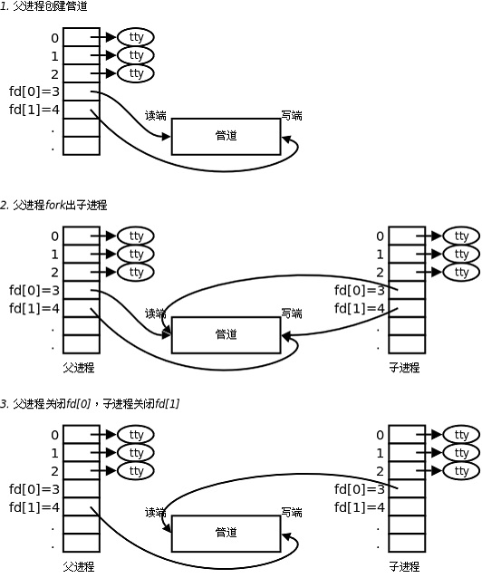
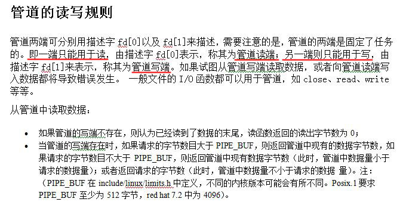

# F2B205 TP1 Programmation système Unix/Linux

## 1. Appels systèmes et fonctions

1. 声明变量的两种方式:

- 方法一. **变量存放在堆区，程序员分配释放**

	声明时
	```c
	struct stat *buffer = malloc(sizeof(struct stat));
	```
	调用时
	```c
	stat(argv[1], buffer);
	```

- 方法二 **变量存放在栈区，由编译器自动分配释放**

	声明时
	```c
	struct stat buffer;
	```
	调用时
	```c
	stat(argv[1], &buffer);
	```

	> 一个由C/C++编译的程序占用的内存分为以下几个部分：
	1、栈区（stack）—由编译器自动分配释放，存放函数的参数值，局部变量的值等。其操作方式类似于数据结构中的栈。
	2、堆区（heap）—一般由程序员分配释放，若程序员不释放，程序结束时可能由OS回收。注意它与数据结构中的堆是两回事，分配方式倒是类似于链表。
	3、全局区（静态区）（static），全局变量和静态变量的存储是放在一块的，初始化的全局变量和静态变量在一块区域，未初始化的全局变量和未初始化的静态变量在相邻的另一块区域。  程序结束后由系统释放。
	4、文字常量区—常量字符串就是放在这里的。程序结束后由系统释放
	5、程序代码区—存放函数体的二进制代码。

2. getpwuid() function

	在程序里连续调用两次getpwuid()函数并分别赋值给不同指针，如下

	```c
	struct passwd *pw = getpwuid(1000);
	struct passwd *pw2 = getpwuid(1001);

	printf("Fichier %s:  mode: %X  Taille: %ld  Proprietaire: %s Proprietaire2: %s\n",
	argv[1], buffer.st_mode, buffer.st_size, pw->pw_name, pw2->pw_name);
	```

	其结果是指针`pw`和`pw2`指向相同的内存地址。所以`pw->pw_name`和`pw2->pw_name`打印结果相同。为什么呢？参见`man getpwuid`里的解释

	> la valeur de reour de function getpwuid() peut vers une zone statique et donc être écrasé par des appels successifs.

	> The  return  value  may  point  to  a  static  area, and may be overwritten by subsequent calls to getpwent(3), getpwnam(), or getpwuid().

	如何避免这个bug? -> deep copy 可以解决问题

## 2. Environnement

- 通过外部变量（全局变量） environ 可获得

```  c
	extern char **environ;
```

- 通过 getenv() function 可获得某个系统变量的值

## 3. fork() 和 exec()

- fork() est l'appel système 子进程从父进程中克隆而来

	返回值为0 表示在子进程，-1 表示出错，其他表示在父进程。参见`man fork`

	> On  success,  the  PID  of  the child process is returned in the parent, and 0 is returned in the child.  On failure, -1 is returned in the parent, no child process is created, and errno is set appropriately.

- exec() est l'appel système

	系统调用 | 作用
	---- | ---
	execl() | 执行文件
	execlp() |  执行文件，考虑path
	execv() | 执行文件，考虑arguments
	execvp() |  执行文件，考虑arguments和path

## 4. Le traitement des signaux

- La définition du signal: **une sorte d'interruption** logicielle envoyée par un processus par le noyau après qu'un événement particulier soit intercenu. 

-  signal() function et sigaction() function 都可以定义处理信号的handler

- signal() 例子如下，可以使用`kill -SIGILL <pid>`来向该进程发送SIGILL信号

	```c
	#include <signal.h>
	#include <stdio.h>
	#include <string.h>

	void sighandler(int signum) {
	printf("Caught signal %d, coming out...\n", signum);
	exit(1);
	}

	int main() {
	printf("PID: %d\n", getpid());
	signal(SIGILL, sighandler);

	while(1) {
		continue;
	}
	}
	```

	**需要注意的是函数signal(SIGILL，sighandler)调用的返回值是之前的handler，返回值类型可以用int表示**

- sigaction()　例子如下，可使用`crtl + c`来向进程发送SIGINT信号

	```c
	#include <signal.h>
	#include <stdio.h>
	#include <string.h>

	void sighandlerINT(int signum) {
	printf("Caught signal %d, coming out...\n", signum);
	exit(1);
	}

	int main() {
	printf("PID: %d\n", getpid());
	struct sigaction sa_int;
	sa_int.sa_handler = &sighandlerINT;
	sigaction(SIGINT, &sa_int, NULL);

	while(1) {
		continue;
	}
	}
	```

	**需要注意的是函数sigaction(SIGINT, &sa_int, NULL)调用的第三个argument会被赋值为之前的handler，这个argument的类型是指向struct sigaction型的指针**

## 5. La terminaison des processus

- processus zombies 僵尸进程: 子进程退出而父进程没有做出相应处理时，子进程会变成僵尸进程(占用资源，无法释放资源，除非kill父进程)

- 子进程退出时，会给父进程发送SIGCLD信号，父进程可以忽略或者处理该信号。一个处理该信号的例子如下

	```c
	void sig_handler(int signum) {
	printf("child signal recevied\n");
	int pid = wait(NULL);
	printf("child process %d terminated\n", pid);
	}

	signal(SIGCLD, sig_handler); //在父进程中调用该函数
	```
- 关于wait()函数的作用，参见`man wait`

	> In the case of a  terminated child, performing a wait allows the system to release the resources associated with the child; if a wait is not performed, then the terminated child remains in a "zombie" state (see NOTES below).

- 如何用wait()函数获取子进程退出前的状态，参见函数签名`pid_t wait(int *status);`，下面是一个例子

	```c
	//在父进程的SIGCLD信号处理函数中使用
	int status;　//申明status变量

	void fin_fils(int n) {
	fils = wait(&status);
	printf("Fils numero: %d\n", fils);

	if (WIFEXITED(status))
		printf("termine sur exit(%d)\n", WIFEXITED(status));

	if (WIFSIGNALED(status))
		printf("termine sur signal %d\n", WIFSIGNALED(status));

	exit(EXIT_SUCCESS);			/* pour terminer le pere */
	}

	signal(SIGCLD, fin_fils);
	```

- 关于`WIFEXITED` 和　`WIFSIGNALED`等macros的使用方法，参见`man wait`

## 6. L’appel système fcntl()

- 系统调用fcnt用于操纵文件描述符，函数签名`int fcntl(int fd, int cmd, ... /* arg */ );` 其参数分别是
	- 文件描述符fd
	- 应用于fd上的命令cmd
	- 以及命令cmd的参数arg

- 比如，想获得二进制表示的所有标志位，orginal_flag在这里是32位的二进制

	```c
	int orginal_flag = -1;
	orginal_flag = fcntl(0, F_GETFL);
	```

- 如果想要给标准输入流(fd=0)加上非阻塞描述标志(non block)　例子如下

	```c
	fcntl(0, F_SETFL, O_NONBLOCK);
	```

- 再比如，想要给标准输入流(fd=0)去掉非阻塞描述标志(non block)　例子如下，`~`是位取反操作

	```c
	fcntl(0, F_SETFL, orginal_flag & ~O_NONBLOCK);
	```

## 7. Les tubes de communication





参考
1. [管道---pipe函数实例讲解 ](http://blog.chinaunix.net/uid-16987232-id-4046436.html)
2. [Linux管道编程实例](http://blog.csdn.net/pcliuguangtao/article/details/6453743)
3. [C语言的变量的内存分配](http://blog.csdn.net/chenyiming_1990/article/details/9476181)
